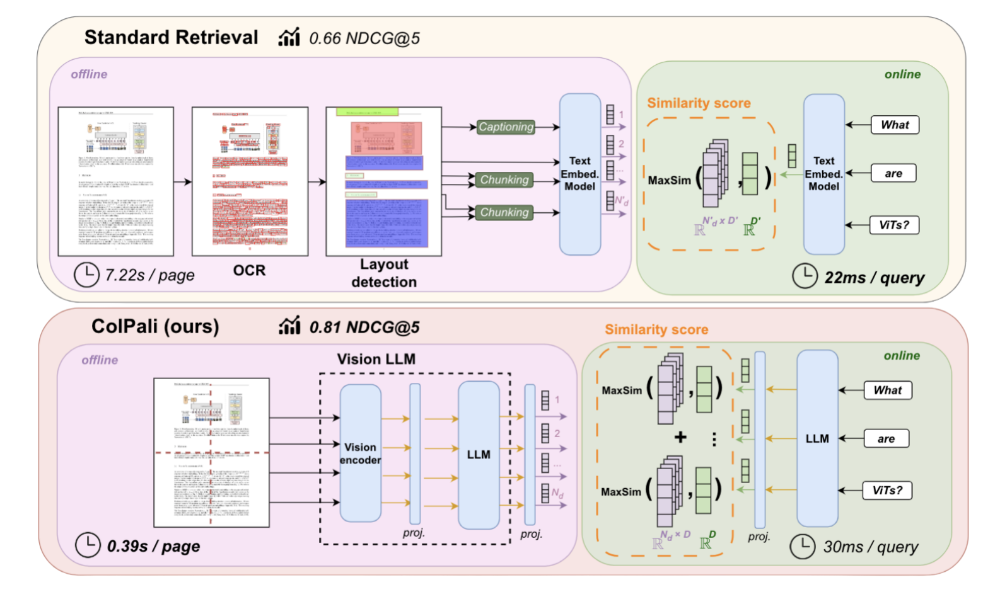

<div align="center">
  
  <h1>LitePali</h1>
  <p>Lightweight Document Retrieval with Vision Language Models</p>
</div>

<p align="center">
  
  
  
</p>

<p align="center">
  <a href="#features">🚀 Features</a> •
  <a href="#model">🧠 Model</a> •
  <a href="#installation">💻 Installation</a> •
  <a href="#usage">📘 Usage</a> •
  <a href="#why-litepali">❓ Why LitePali</a> •
  <a href="#contributing">🤝 Contributing</a>
  <a href="#todo">🏗 TODO</a>
</p>

---

# LitePali

LitePali is a lightweight document retrieval system I created, inspired by the ColPali model and optimized for cloud
deployment. It's designed to efficiently process and search through document images using state-of-the-art
vision-language models.

## 🚀Features

📦 Minimal dependencies
🖼️ Direct image processing without complex PDF parsing
🔄 Deterministic file processing
⚡ Batch processing for multiple files
☁️ Optimized for cloud environments

## 🧠Model

LitePali is built on the ColPali architecture, which uses Vision Language Models (VLMs) for efficient document
retrieval.

Key features include:

1. **Late Interaction Mechanism**: Enables efficient query matching while maintaining context.
2. **Multi-Vector Representations**: Generates fine-grained representations of text and images.
3. **Visual and Textual Understanding**: Processes document images directly, understanding both content and layout.
4. **Efficient Indexing**: Faster corpus indexing compared to traditional PDF parsing methods.



This approach allows LitePali to perform efficient retrieval while capturing complex document structures and content.

## Inspiration

This library is inspired by [byaldi](https://github.com/AnswerDotAI/byaldi), but with several key differences:

- **Focus on images**: LitePali works exclusively with images, allowing PDF processing to be handled separately on
  CPU-only environments.
- **Simplified dependencies**: No need for Poppler or other PDF-related dependencies.
- **Updated engine**: Utilizes `colpali-engine` >=0.3.0 for improved performance.
- **Deterministic processing**: Implements deterministic file processing for consistent results.
- **Efficient batch processing**: Employs batch processing when adding multiple files, enhancing performance.
- **Customized functionality**: Tailored for specific needs while building upon the excellent foundation laid by
  byaldi.

These differences make LitePali a more streamlined and focused tool for image-based document retrieval, offering
flexibility in deployment and integration with existing PDF processing pipelines.

## Installation

Install LitePali using pip:

```bash
pip install litepali
```

## Usage

Here's a simple example of how to use LitePali:

```python
from litepali import LitePali, ImageFile

# Initialize LitePali
litepali = LitePali()

# Add some images with metadata and page information
litepali.add(ImageFile(
    path="path/to/image1.jpg",
    document_id=1,
    page_id=1,
    metadata={"title": "Introduction", "author": "John Doe"}
))
litepali.add(ImageFile(
    path="path/to/image2.png",
    document_id=1,
    page_id=2,
    metadata={"title": "Results", "author": "John Doe"}
))
litepali.add(ImageFile(
    path="path/to/image3.jpg",
    document_id=2,
    page_id=1,
    metadata={"title": "Abstract", "author": "Jane Smith"}
))

# Process the added images
litepali.process()

# Perform a search
results = litepali.search("Your query here", k=5)

# Print results
for result in results:
    print(f"Image: {result['image'].path}, Score: {result['score']}")

# Save the index
litepali.save_index("path/to/save/index")

# Later, load the index
new_litepali = LitePali()
new_litepali.load_index("path/to/save/index")
```

This example demonstrates how to add images, process them, perform a search, and save/load the index.

## Why LitePali?

I created LitePali to address the need for a lightweight, efficient document retrieval system that could work directly
with images. By leveraging the power of vision-language models like ColPali, LitePali can understand both textual and
visual elements in documents, making it ideal for complex document retrieval tasks.

LitePali is designed to be easy to use and deploy in cloud environments, making it a great choice for researchers and
developers working on document retrieval systems.

## Contributing

Contributions are welcome! Feel free to submit issues or pull requests if you have any improvements or bug fixes.

## TODO

Future improvements and features planned for LitePali:

- [ ] **Enhanced index storage**
    - Implement storage of base64-encoded versions of images within the index.
    - This will allow for quick retrieval and display of images without needing to access the original files.

- [ ] **Performance optimizations**
    - Tests with flash-attention.
    - This optimization is expected to significantly speed up processing times, especially for large batches of images.

- [ ] **Quantization support**
    - Add support for lower precision (e.g., int8, int4) to reduce memory footprint and increase inference speed.

- [ ] **API enhancements**
    - Develop a more comprehensive API for advanced querying and filtering options.

- [ ] **Documentation expansion**
    - Create more detailed documentation, including advanced usage examples and best practices.
